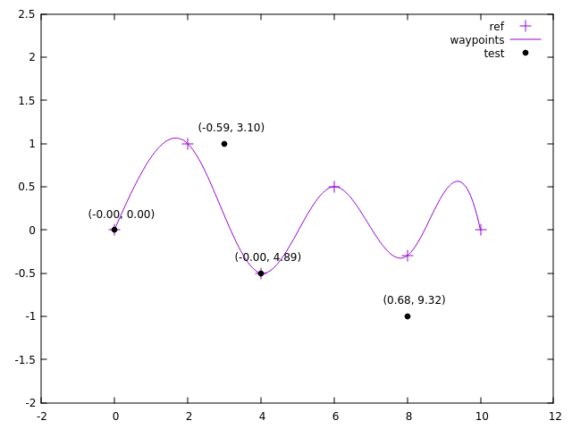

# Frenet Assignment

In autonomous driving, the Frenet coordinate system is often used. In the Frenet system, the coordinate of an object is defined by two values: the longitudinal and the lateral position of the object with respect to a reference line.

In this problem, the reference is given as a finite list of points. The tasks are
1. Constructs a continuous reference line given an input list of points in a cartersian coordinate C1.
2. Provides functionality to convert any point in the cartersian coordinate C1 (that is, in the same coordinate with the list of points used to construct the continuous reference line) to the frenet coordinate. Following the direction of the given input points, the first point on the input list has the longitudinal position of 0. All points on the reference line have the lateral position of 0. All points to the left of the reference line have negative lateral position and all points to the right have the positive lateral position.

## Instructions
### Python
The code `frenet_assignment.ipynb` is written in Jupyter Notebook, can be viewed directly on github site.
#### Result

- Blue points are given reference.
- Red line is countinuos reference line
- Points with label is testing for the coordinate transformation from Cartesian to Frenet, label includes lateral and logitudinal position of the point in Frenet coordinate

### CPP
Codes are in `cpp` folder. Compiled using `g++` in Linux OS. To view the graph, `gnuplot` is required.
- Run `make` to compile the code, result with be the excutable `demo` file.
- Run `./plot.sh` to execute the `demo` file, result will be `plot.cvs` file and the graph.

#### Result

Result is similar to the one from Python. There are small differences in the test Frenet label coming from the differences of `spline` algorithm and in sampling of the 2 programs.
